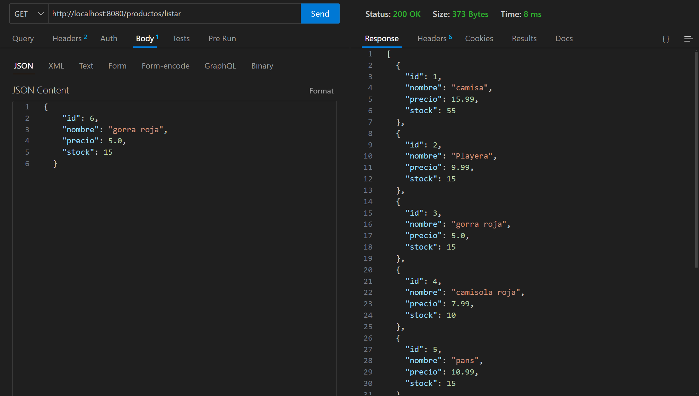

# muestra del funcionamiento de mi codigo

### listar 

http://localhost:8080/productos/listar

### eliminar 

http://localhost:8080/productos/eliminar/2

### guardar

http://localhost:8080/productos/guardar

### actualizar
http://localhost:8080/productos/guardar

